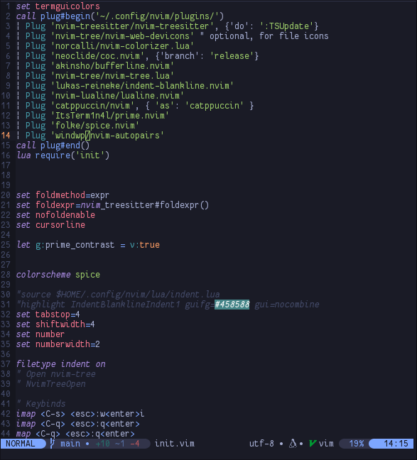

## My Configuration files for Neovim.

___
This configuration includes Nvim-treesitter, Indent-blankline, lualine, colorizer, nvim-tree, coc and nvim-autopairs.    
Themed with [spice.nvim](https://github.com/ItsTerm1n4l/spice.nvim)   

### Installation.
First install nvim-plug if it is not already installed.    
`sh -c 'curl -fLo "${XDG_DATA_HOME:-$HOME/.local/share}"/nvim/site/autoload/plug.vim --create-dirs \
       https://raw.githubusercontent.com/junegunn/vim-plug/master/plug.vim'`

Install configuration files.
```
git clone https://github.com/ItsTerm1n4l/nvim-config nvim
cp -r ./nvim "$HOME"/.config/
nvim --cmd ":PlugInstall"
```
Enjoy!

